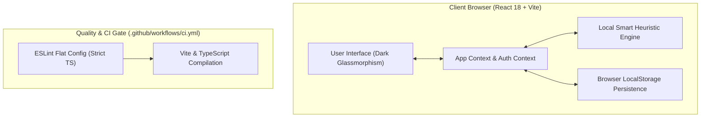

# 🚀 OpportunityPulse AI — Agentic Opportunity Radar & Application Copilot

> **HEC ACT-AI Capstone Project Report — Phase 0 Security & Hardening Build**
>
> **Author / Maintainer**: Arsalan Qasim
>
> **Live Application URL**: [https://opportunity-pulse-gdloz9ftf-arsalanqasims-projects.vercel.app/](https://opportunity-pulse-gdloz9ftf-arsalanqasims-projects.vercel.app/)
>
> **Public GitHub Repository**: [https://github.com/arsalanqasim/act-ai-final-project](https://github.com/arsalanqasim/act-ai-final-project)
> **Current Build Status**: Phase 0 Hardened Prototype (Zero-Key Heuristic Engine, Client Security Hardened, CI Quality Gates Active)

---

## 📌 1. Project Context & Problem Statement

### The Problem
Every year, thousands of university students, fresh graduates, and tech youth across Pakistan miss out on high-signal career opportunities—such as international scholarships (Fulbright, Erasmus Mundus, HEC grants), global AI hackathons (Lablab.ai, Devpost, MLH), remote software engineering internships, and R&D grants (Ignite NGIRI).

**Key Friction Points:**
1. **Social Media Noise**: High-signal opportunities get buried rapidly under social feed algorithms and messaging group chatter.
2. **Fragmented Listings**: Opportunities are siloed across disparate platforms with inconsistent deadlines and formatting.
3. **Application & Pitch Friction**: Applicants struggle to quickly quantify their suitability or structure custom pitches aligned with opportunity criteria.

### The Solution
**OpportunityPulse AI** provides a centralized, privacy-safe Opportunity Radar. It matches candidate profiles against active opportunity listings using a deterministic scoring engine, parses unstructured text, and generates tailored Markdown application pitches.

---

## ⚡ 2. Current Capabilities & Feature Matrix (Phase 0 vs Phase 1)

| Feature | Phase 0 Status (Current Build) | Phase 1 Roadmap (Upcoming) |
| :--- | :--- | :--- |
| **Opportunity Matching Engine** | Working (Local Smart Heuristic, 0-100 Match Index) | Server-Side Gemini 2.0 Flash Semantic Scorer |
| **Unstructured Text Ingestion** | Working (Client-Side Heuristic & RegEx NLP Parser) | Server-Side LLM Extractor & Web Scraper |
| **Resume / CV Parsing** | Working (Local Regex & Keyword Skill Extractor) | Multi-page PDF/Document Vision Parser |
| **Application Copilot Pitch** | Working (Algorithmic Markdown Pitch Generator) | Server-Side Custom Proposal Writer |
| **API Key Security** | **Zero-Key Protocol** (No keys in client bundle) | Server-Side Encrypted API Key Proxy |
| **User Authentication** | Local Demo Auth & Session Persistence | Supabase / PostgreSQL Database Auth |
| **Code Quality & Gates** | Strict TypeScript + ESLint + GitHub Actions CI | Full Unit & E2E Test Suite |

---

## 🧠 3. Decision Engine & Heuristic Algorithm

Phase 0 operates using a **100% deterministic, privacy-safe local heuristic matching engine**. This ensures immediate execution with zero reliance on browser-side API keys or external network endpoints.

### Match Index Scoring Formula (0–100%)
$$\text{Total Match Score} = \min\Big(98, \; 30 \;+\; S_{\text{skills}} \;+\; S_{\text{category}} \;+\; S_{\text{location}}\Big)$$

- **Base Score ($30\text{ pts}$)**: Default baseline.
- **Skill Overlap ($S_{\text{skills}}$, up to $40\text{ pts}$)**: Calculated as $\text{Math.round}\left(\frac{N_{\text{matched}}}{N_{\text{required}}} \times 40\right)$.
- **Category Match ($S_{\text{category}}$, $15\text{ pts}$)**: Awarded if the listing category matches candidate target preferences.
- **Location Alignment ($S_{\text{location}}$, up to $15\text{ pts}$)**: Awarded for format alignment (Remote, Pakistan Local, or Global Exchange).

> [!NOTE]
> *Phase 1 will transition LLM evaluation to server-side API routes (Vercel Serverless Functions / Node backend), keeping API keys strictly on the server.*

---

## 🔒 4. Privacy & Security Protocol

- **Zero Secret Exposure**: No API keys are present in application source code, local storage, environment files, or compiled frontend assets.
- **Legacy Key Cleanup**: Includes an automatic client-side migration that clears legacy API keys (`opp_pulse_gemini_api_key_v2`) from user local storage.
- **Local Data Handling**: Profile details, uploaded CV text, and ingested posts are processed directly in the user's browser without being transmitted to unverified third-party LLM APIs.

---

## 🛠️ 5. Technology Stack & Architecture



- **Frontend**: React 18, TypeScript 5, Vite 6
- **Styling**: Tailwind CSS, Custom Glassmorphism Utilities
- **Icons**: Lucide React
- **Code Quality**: ESLint (Flat Config), Strict TypeScript (`no-explicit-any`)
- **Continuous Integration**: GitHub Actions CI Pipeline (`.github/workflows/ci.yml`)

---

## 📸 6. Screenshots & Visual Demonstrations

> [!IMPORTANT]
> **TODO**: Screenshots must be captured and placed under `docs/screenshots/` following the final UI deployment update.

Planned screenshots:
1. `docs/screenshots/01_hero_and_radar.png` — Main dashboard showing active listings and match fit scores.
2. `docs/screenshots/02_engine_privacy_modal.png` — Transparent Engine Status & Data Privacy modal.
3. `docs/screenshots/03_application_copilot.png` — Markdown pitch draft generated by the Application Copilot.

---

## 💻 7. How to Run Locally

### Prerequisites
- Node.js (v18.0.0 or higher)
- npm (v9.0.0 or higher)

### Steps

1. **Clone the Repository**:
   ```bash
   git clone https://github.com/arsalanqasim/act-ai-final-project.git
   cd act-ai-final-project
   ```

2. **Install Dependencies**:
   ```bash
   npm install
   ```

3. **Run Development Server**:
   ```bash
   npm run dev
   ```
   Open your browser at `http://localhost:5173`.

4. **Run Quality Verification Commands**:
   ```bash
   # Run ESLint checks
   npm run lint

   # Test TypeScript compilation and production bundle build
   npm run build
   ```

*(Note: No environment variables or API keys are required to run Phase 0.)*

---

## 🎓 8. Step-by-Step Grader Walkthrough

1. **Profile Setup & Calibration**:
   - Launch the application. Click **Edit** on the active profile banner or open **Edit Profile & Skills**.
   - Add skills (e.g., `Python`, `React`, `Generative AI`) or click **Upload CV / Auto-Fill** to test local resume parsing.
2. **Filtering & Match Scoring**:
   - Observe real-time 0-100% Match Fit calculations updated dynamically per card.
   - Filter listings using Category tabs (*Hackathon, Scholarship, Internship, Grant*), Search Query, or Location filter.
3. **Unstructured Opportunities Ingestion**:
   - Click **Ingest Link/Text** in the top navigation bar.
   - Click **Paste Sample Post** to populate raw post text, then click **Extract & Add Opportunity**.
   - Verify the new opportunity card is prepended to your feed with calculated match fit.
4. **Generating & Exporting Application Pitches**:
   - Click **Copilot Pitch** on any opportunity card.
   - View the formatted Markdown application pitch generated for your profile.
   - Test **Copy Pitch Text** or **Download .MD** to export your pitch draft.
5. **Engine Status Verification**:
   - Click the gear icon in the navbar to open **Engine Status & Data Privacy**.
   - Verify zero API keys are requested and local zero-key heuristic mode is active.

---

## 🔮 9. Known Limitations & Phase 1 Roadmap

- **Browser Storage**: Phase 0 uses browser `localStorage` for session data. Phase 1 will add backend database persistence (Supabase / PostgreSQL).
- **Server-Side AI**: Phase 0 uses client-side heuristic logic. Phase 1 will route requests through serverless backend functions utilizing Gemini 2.0 Flash for semantic LLM matching and pitch drafting.
- **Automated Ingestion**: Source scraping and email alerts will be implemented in backend cron tasks during Phase 1.
