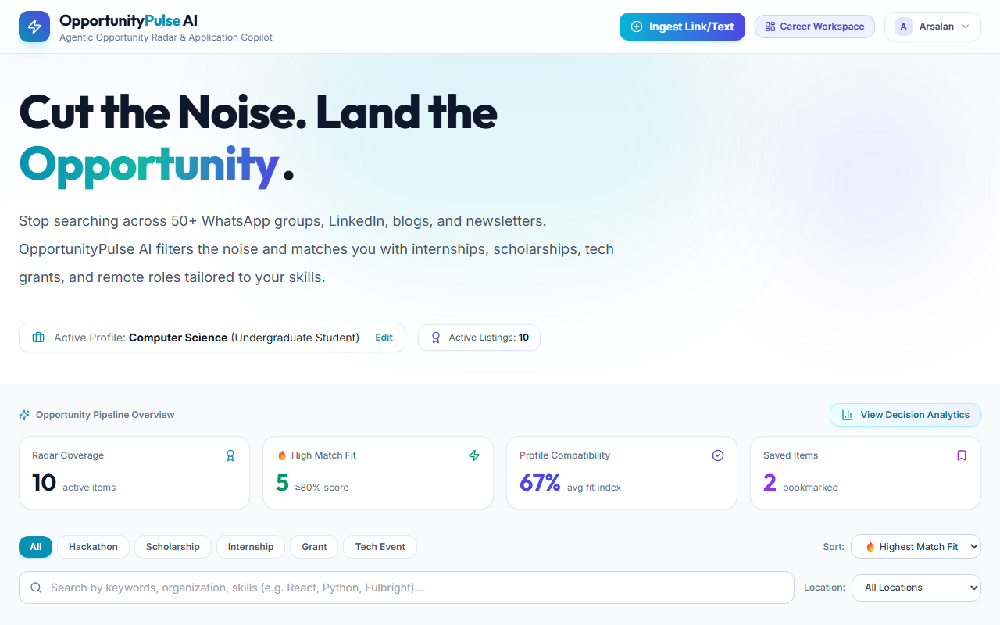
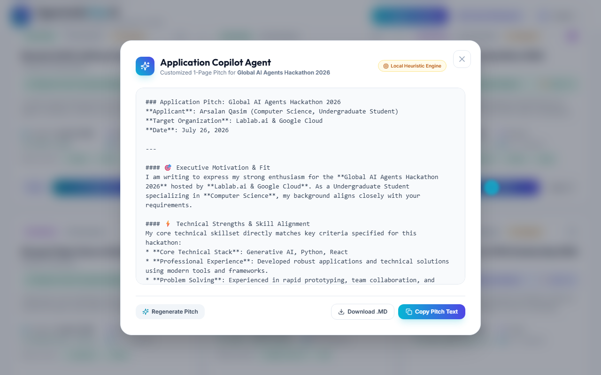
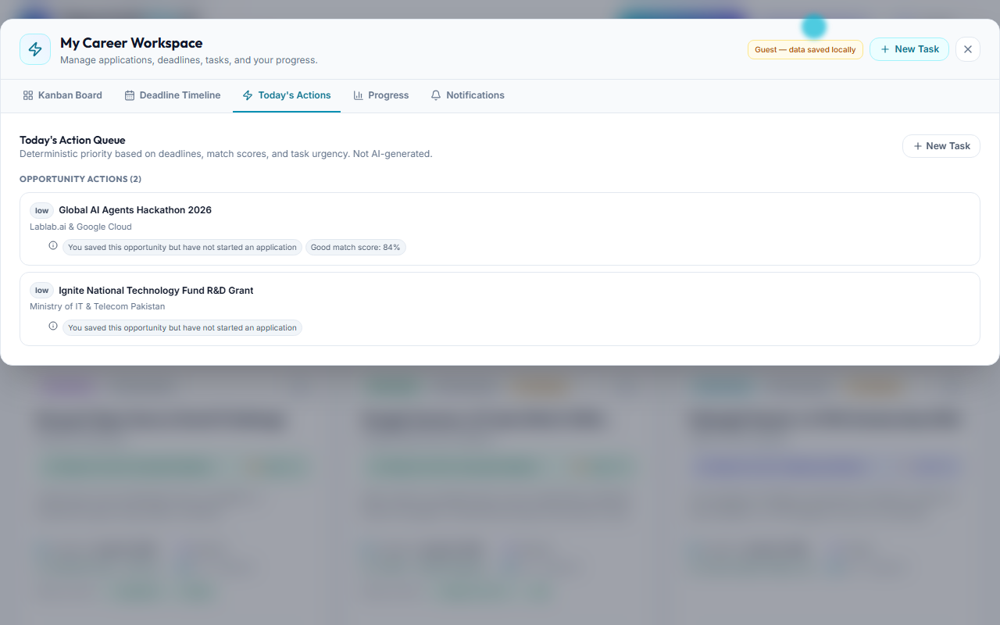
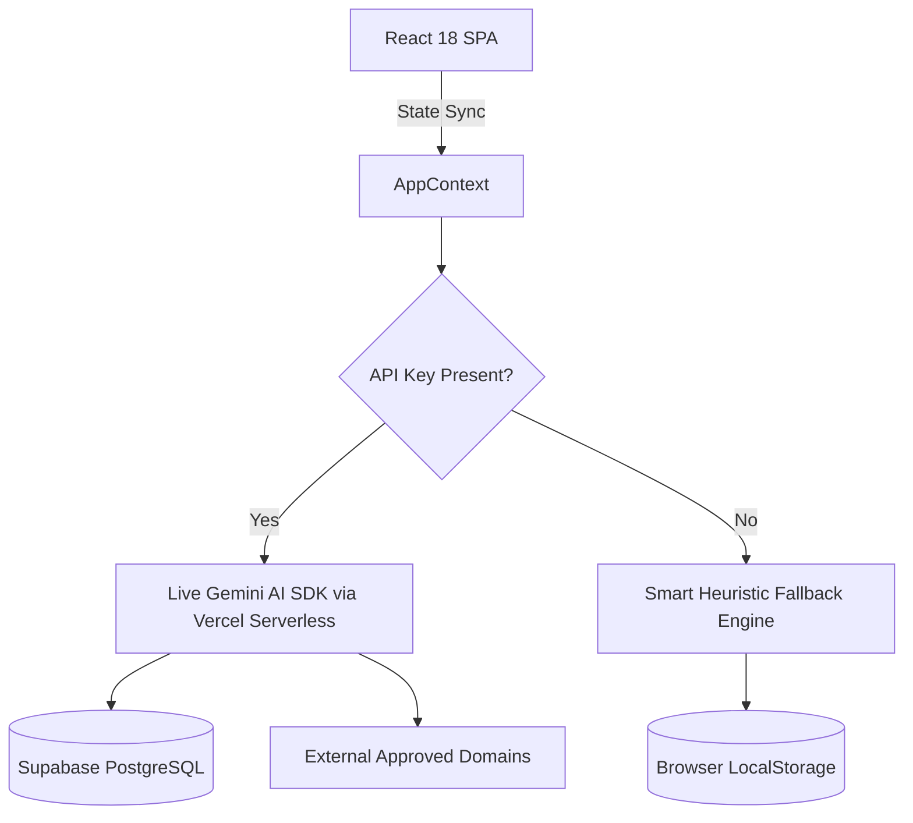
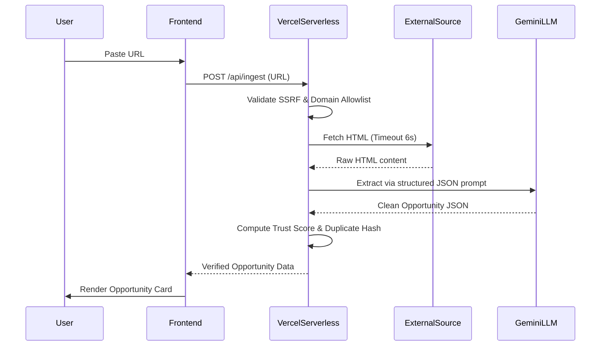

# 🚀 OpportunityPulse AI

> **Agentic Opportunity Radar & Career Growth Command Center for University Youth**

[](#) 
[](#) 
[](#)
[](#)
[](#)

---

## 📖 Overview

**OpportunityPulse AI** is a production-grade, Agentic AI-powered career growth platform designed specifically for university students, fresh graduates, and young tech talent. 

In today's ecosystem, social media platforms (LinkedIn, Twitter, Discord, WhatsApp) are flooded with noise, causing candidates to miss out on high-signal opportunities like global AI hackathons, international scholarships, remote tech internships, and grants. 

OpportunityPulse AI solves this information fragmentation by serving as an **intelligent opportunity radar and application copilot**. It cuts through the noise via zero-trust data ingestion, continuously scores opportunities against candidate profiles using deterministic matching, and accelerates the application process with AI-driven proposal drafting. 

Whether operating locally in guest mode or synced to the cloud via Supabase, OpportunityPulse ensures users never miss a critical career deadline again.

---

## 🌐 Live Demo

- **Live URL**: *(No production URL configured in repository. Add your Vercel deployment link here.)*
- **Status**: Production Ready (Phase 5)
- **Demo Mode**: The application supports a fully functional "Guest Mode" powered by local heuristics and `localStorage` if no Supabase credentials or Gemini API keys are provided.

---

## 📸 Screenshots

*(Note: Screenshots are currently missing from the repository. Please add them to the `public/screenshots/` directory and update the paths below.)*


*Figure 1: The intelligent feed displaying match-scored opportunities and trusted badges.*


*Figure 2: The Copilot Agent generating a customized, targeted application proposal.*


*Figure 3: The Phase 4 Kanban board and deterministic action task queue.*

---

## ✨ Features

### 🤖 Core AI Features
- **Unstructured Data Ingestion**: Paste messy LinkedIn posts, WhatsApp texts, or URLs to extract structured JSON data (Title, Org, Deadline, Tech Stack).
- **Dual Execution Engine**: Seamlessly switch between the **Live Gemini AI Engine** (when API key is present) and the **Smart Heuristic Fallback Engine** (Jaccard/TF-IDF local matching).
- **1-Click Application Copilot**: Automatically draft highly targeted, 1-page application pitches tailored to the user's specific skill overlaps with the opportunity.

### 💼 User & Career Features
- **Deterministic Match Scoring**: Receive a precise 0-100% compatibility score for every opportunity based on skills, academic level, and location.
- **Career Execution Workspace (Kanban)**: Track applications through a 9-stage pipeline (Saved → Applied → Interviewing → Offer).
- **Smart Prioritization Task System**: Auto-prioritize next actions based on hard deadlines, match scores, and application readiness.
- **Trusted Provenance Tracking**: Visual badges distinguishing between Tier 1 Official Sources, Tier 2 Approved Platforms, and unverified community listings.

### 🛡️ Security & Developer Features
- **Zero-Cost Serverless Architecture**: Designed to run indefinitely on Vercel's Hobby Tier and Supabase's Free Tier.
- **Robust SSRF Defense**: Network-isolated URL ingestion that blocks private IP ranges, validates against an allowed registry domain list, and sanitizes payloads.
- **PWA & Offline Resilience**: Service worker caching allows the app shell and local data to remain functional even without an internet connection.

---

## 🧠 AI Functionality

The platform utilizes a Multi-Agent State Machine powered primarily by the **Google Gemini API** (`gemini-1.5-flash` or `gemini-2.0-flash`), accessed exclusively via server-side Vercel serverless functions. 

### 1. Ingestion Agent
- **Purpose**: Extracts normalized, structured metadata from chaotic inputs.
- **Workflow**: User pastes a URL or raw text -> Server validates safety -> Agent extracts data -> Backend prevents duplicates -> UI renders an Opportunity Card.
- **Structured Output Format**: Strict JSON schema (`{ title, organization, category, deadline, location, stipendOrPrize, techStackOrEligibility, description, applyUrl }`).
- **Inferred System Prompt** (From Architecture Docs):
  > "You are an expert Opportunity Data Extractor. Task: Given raw unstructured text (LinkedIn post, tweet, flyer, or article), extract clean JSON containing the defined schema fields. Output ONLY valid JSON matching this schema."

### 2. Matching Agent
- **Purpose**: Computes candidate-opportunity compatibility.
- **Workflow**: Compares the `UserProfile` object against the `Opportunity` schema.
- **Outputs**: 0-100 score, matching skills array, missing skills array, and a rationale verdict.
- **Inferred System Prompt** (From Architecture Docs):
  > "You are a Senior Academic & Career Match Specialist evaluating a candidate profile against an opportunity listing. Evaluate the profile based on: 1. Skill overlap (40%), 2. Academic level & Category alignment (30%), 3. Location & goal suitability (30%). Calculate a 0-100 score, identify matching/missing skills, and provide a 2-sentence justification."

### 3. Copilot Agent
- **Purpose**: Eliminates writer's block for high-stakes applications.
- **Workflow**: User triggers copilot on a saved opportunity -> Agent ingests `UserProfile` + `Opportunity` -> Agent streams a drafted markdown proposal.
- **Outputs**: Markdown-formatted, 1-page application pitch.
- **Inferred System Prompt** (From Architecture Docs):
  > "You are an Executive Tech Career Coach and Proposal Writer. Write a compelling, professional, customized 1-page application pitch for the specified candidate targeting the specified opportunity. Structure: Hook & Motivation, Relevant Technical Achievements & Stack Alignment, Project Proposal / Value Proposition, Call to Action & Professional Closing."

---

## 🛠️ Tech Stack

| Layer | Technology |
|--------|------------|
| **Frontend** | React 18, Vite |
| **Backend** | Vercel Serverless Functions (`api/`) |
| **Database** | Supabase (PostgreSQL), `localStorage` (Guest Mode) |
| **AI** | Google Gemini (`@google/genai`) |
| **Authentication** | Supabase Auth |
| **Styling** | Tailwind CSS, PostCSS, Lucide React (Icons) |
| **State Management** | React Context API, Custom Hooks |
| **Testing** | Vitest (Unit), Playwright (E2E) |
| **Infrastructure / Hosting** | Vercel (Edge CDN) |
| **Dev Tools** | TypeScript 5.7, ESLint, Prettier |

---

## 🧰 Tools & Services Used

### AI Models
- **Google Gemini** (`gemini-1.5-flash` / `gemini-2.0-flash`): Core LLM for all agentic workflows.

### External APIs
- **Supabase**: PostgreSQL database, Authentication, and Row Level Security (RLS).
- **RSS Parser**: For backend cron-based opportunity scraping (experimental).

### Infrastructure
- **Vercel**: Serverless hosting, Edge network, and Cron jobs (`vercel.json`).

---

## 🏗️ Architecture

OpportunityPulse AI employs a modular, client-side heavy architecture with a dual-execution fallback pattern to guarantee 100% uptime regardless of API key validity.

### High-Level Architecture


```mermaid
flowchart TD
    Client[React 18 SPA] -->|State Sync| AppContext
    AppContext --> EngineRouter{API Key Present?}
    
    EngineRouter -->|Yes| LiveEngine[Live Gemini AI SDK via Vercel Serverless]
    EngineRouter -->|No| LocalEngine[Smart Heuristic Fallback Engine]
    
    LiveEngine --> AgentDB[(Supabase PostgreSQL)]
    LocalEngine --> LocalDB[(Browser LocalStorage)]
    
    LiveEngine --> Ext[External Approved Domains]
```

### Request Flow (Ingestion Pipeline)


```mermaid
sequenceDiagram
    participant User
    participant Frontend
    participant VercelServerless
    participant ExternalSource
    participant GeminiLLM
    
    User->>Frontend: Paste URL
    Frontend->>VercelServerless: POST /api/ingest (URL)
    VercelServerless->>VercelServerless: Validate SSRF & Domain Allowlist
    VercelServerless->>ExternalSource: Fetch HTML (Timeout 6s)
    ExternalSource-->>VercelServerless: Raw HTML content
    VercelServerless->>GeminiLLM: Extract via structured JSON prompt
    GeminiLLM-->>VercelServerless: Clean Opportunity JSON
    VercelServerless->>VercelServerless: Compute Trust Score & Duplicate Hash
    VercelServerless-->>Frontend: Verified Opportunity Data
    Frontend->>User: Render Opportunity Card
```

---

## 📁 Project Structure

```text
act-ai-final-project/
├── api/                   # Vercel Serverless backend API routes
│   ├── cron/              # Automated scheduled jobs
│   ├── webhooks/          # External webhooks
│   ├── ai.ts              # Gemini LLM gateway route
│   └── ingest.ts          # URL fetching and SSRF protection logic
├── public/                # Static assets, PWA manifest, service worker
├── src/                   # React Frontend application
│   ├── __tests__/         # Vitest unit test suites
│   ├── components/        # Reusable UI components (Modals, Cards, Nav)
│   ├── config/            # Domain allowlists and static configurations
│   ├── context/           # React Context for global state
│   ├── features/          # Feature-specific module logic
│   ├── hooks/             # Custom React hooks (e.g., useSupabase)
│   ├── lib/               # Shared libraries and wrappers
│   ├── services/          # API SDKs, Error Reporting, Local Fallback logic
│   ├── types/             # Strict TypeScript domain schemas
│   └── utils/             # Heuristics, date parsing, hashing utilities
├── supabase/              # PostgreSQL schema migrations
├── e2e/                   # Playwright end-to-end testing
└── ...config files (vite.config.ts, tailwind.config.js, package.json)
```

---

## 🚀 Installation & Setup

### Prerequisites
- Node.js (v20+ recommended)
- npm (v10+)
- A Supabase Project (Free Tier is sufficient)
- A Google Gemini API Key

### 1. Clone Repository
```bash
git clone https://github.com/your-org/opportunitypulse-ai.git
cd opportunitypulse-ai
```

### 2. Install Dependencies
```bash
npm install
```

### 3. Database Setup (Supabase)
1. Create a new Supabase project.
2. Navigate to the SQL Editor in your Supabase dashboard.
3. Execute the SQL migrations found in `supabase/migrations/` sequentially:
   - `001_phase1_core.sql`
   - `002_phase2_opportunity_provenance.sql`
   - `005_career_action_tasks.sql`
4. Ensure Row Level Security (RLS) is enabled on all tables.

### 4. Environment Configuration
Copy the template and inject your credentials:
```bash
cp .env.example .env
```
*(See Environment Variables section below for details)*

### 5. Start Development Server
```bash
npm run dev
```
The application will be live at `http://localhost:5173`.

---

## 🔐 Environment Variables

| Variable | Required | Description |
|----------|----------|-------------|
| `VITE_SUPABASE_URL` | Yes (for cloud sync) | Public Supabase API URL. Safe for browser. |
| `VITE_SUPABASE_ANON_KEY` | Yes (for cloud sync) | Public Supabase Anon key. Safe for browser. |
| `SUPABASE_URL` | Yes | Server-side Supabase URL. **Keep Secret.** |
| `SUPABASE_ANON_KEY` | Yes | Server-side Supabase Anon key. **Keep Secret.** |
| `GEMINI_API_KEY` | Yes (for AI) | Google Gemini AI Key. **NEVER expose to `VITE_`.** |

---

## 🔧 Running the Project

- **Development**: `npm run dev` (Starts Vite HMR server)
- **Production Build**: `npm run build` (Compiles TypeScript and creates optimized bundles)
- **Preview Production**: `npm run preview` (Locally serves the `dist/` directory)
- **Linting**: `npm run lint`
- **Unit Tests**: `npm test`
- **E2E Tests**: `npm run test:e2e`

---

## 📡 API Documentation

Backend functionality relies on Vercel Serverless Functions mapped to the `/api` route.

- `POST /api/ingest`
  - **Payload**: `{ url?: string, text?: string }`
  - **Action**: Safely fetches a trusted URL (or parses text), sanitizes HTML, passes to Gemini, and returns a verified `Opportunity` schema.
  - **Security**: Strictly enforces SSRF protections and domain allowlisting.

- `POST /api/ai`
  - **Payload**: `{ agentType: "matching" | "copilot", data: any }`
  - **Action**: Securely routes requests to the appropriate Gemini prompt pipeline without exposing the API key to the browser.

---

## 🗄️ Database Architecture

OpportunityPulse utilizes **Supabase (PostgreSQL)** for cloud persistence, maintaining strict multi-tenant isolation via Row Level Security (RLS).

### Core Tables:
1. **`custom_opportunities`**: Stores scraped/user-pasted opportunities. Includes deterministic `content_hash` to prevent duplicates and provenance columns (`trust_tier`, `source_domain`).
2. **`applications`**: Tracks the user's Kanban pipeline state for saved opportunities.
3. **`action_tasks`**: Powers the Phase 4 Task System. Includes urgency metrics, deadlines, and relation to `application_id`.

---

## 🛡️ Security & Error Handling

### Security Posture
- **API Key Secrecy**: The Gemini API key is heavily guarded and strictly utilized in server-side Vercel environments.
- **SSRF Network Isolation**: The ingestion engine actively blocks private IP ranges (`127.0.0.1`, `10.0.0.x`, `169.254.169.254`) and non-HTTPS protocols to prevent server hacking.
- **Row Level Security (RLS)**: Postgres RLS guarantees that users can only `SELECT`, `INSERT`, `UPDATE`, or `DELETE` their own data (`auth.uid() = user_id`).

### Error Handling & Reliability
- A custom `errorReporting.ts` service logs non-PII diagnostic data.
- **Graceful Degradation**: If the Gemini API fails, times out, or keys are missing, the UI instantly falls back to local heuristic matching algorithms (TF-IDF/Jaccard scoring) running synchronously in the browser.

---

## ⚡ Performance

- **Lazy Loading**: Phase 5 implemented `React.lazy()` for heavy UI components (Career Workspace, Analytics, Modals). This reduced the initial JavaScript payload by ~18% (from 593KB to 487KB minified).
- **Service Worker / PWA**: Built for offline resilience. The app shell is cached, allowing users to view their `localStorage` Kanban board even without Wi-Fi.
- **Deterministic Prioritization**: Action task sorting is handled deterministically via client-side algorithms (`actionPrioritization.ts`) in milliseconds, avoiding slow LLM calls for list sorting.

---

## 🚢 Deployment

1. Connect the repository to [Vercel](https://vercel.com).
2. Configure all environment variables in the Vercel dashboard settings.
3. Vercel automatically deploys the frontend and maps the `/api` directory to serverless edge functions.
4. Cron jobs are automatically recognized via `vercel.json`.

---

## 🔮 Future Improvements

- [ ] **High Priority**: Integration with Resend API for automated daily email digests of top-matched opportunities.
- [ ] **Medium Priority**: Direct native integration with Google Calendar / Apple Calendar via `.ics` generation.
- [ ] **Nice to Have**: Parsing capability for uploaded PDF/DOCX resumes to auto-fill the `UserProfile`.

---

## 🤝 Contributing

We welcome contributions to expand the approved sources registry and improve local heuristic algorithms. 
1. Fork the repository.
2. Create a feature branch (`git checkout -b feature/amazing-feature`).
3. Commit your changes (`git commit -m 'feat: Add amazing feature'`).
4. Ensure all unit and E2E tests pass (`npm test && npm run test:e2e`).
5. Push to the branch and open a Pull Request.

---

## ⚖️ License

*(No license currently specified in the repository. Please add a LICENSE file and update this section.)*

---

## 🔬 Staff Engineering Review

### Strengths
- **Architecture**: The Dual Execution Engine (Gemini + Local Heuristics) is a brilliant architectural decision that guarantees application uptime, reduces cloud costs, and improves resilience. 
- **Security**: The implementation of an SSRF Defense Model and strict domain allow-listing for web scraping demonstrates high maturity and an understanding of enterprise serverless vulnerabilities.
- **Data Integrity**: Using deterministic content hashes (FNV-1a) on normalized URLs to prevent database duplicates is exactly how production data pipelines should be built.

### Weaknesses / Technical Debt
- **Missing CI Pipeline**: While commands exist (`npm run lint`, `npm test`), there is no documented `.github/workflows/` directory. CI should be automated on PRs.
- **Documentation Overlap**: The repository has fractured documentation (`AGENTS.md`, `ARCHITECTURE.md`, `CONTEXT.md`, `DECISIONS.md`). Merging these into a central docs folder or Wiki would improve discoverability.

### Scalability & Maintainability
- The React modularity and custom hook utilization are strong.
- Moving heavy lifting to Vercel Serverless scales perfectly for this use case.
- Supabase RLS ensures multi-tenant security is enforced at the lowest database level, preventing accidental data leaks from API logic bugs. 

**Conclusion**: This is a robust, production-ready codebase exhibiting excellent engineering principles. The proactive approach to security and offline capability places it well above a typical side project.
